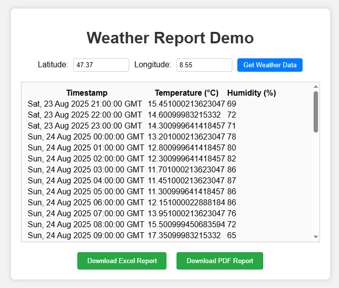
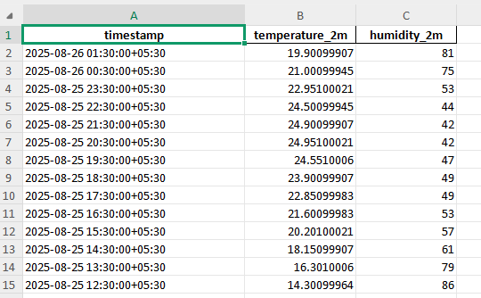
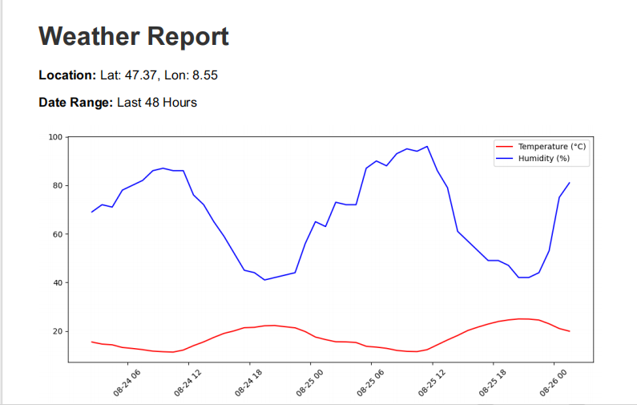

# 🌦 Weather Service  

A Flask-based backend application that fetches, stores, and exports **48-hour weather data** (temperature & humidity) using the [Open-Meteo API](https://open-meteo.com/).  
The service supports:  
- 📡 Fetching real-time & past 2 days weather data  
- 📊 Exporting reports to **Excel** & **PDF**  
- 🗄 Data storage in **SQLite**  
- 🌍 CORS-enabled API for frontend integration  

---

## Project structure
````
|-- Client
|   |-- index.html
|   |-- script.js
|   `-- styles.css
|-- README.md
|-- Server
|   |-- Excel Report
|   |-- PDF Report
|   |-- WeatherService.py
|   |-- requirements.txt
|   `-- weather.db

````
## Issue Faced

### Error

````
OSError: cannot load library 'libgobject-2.
0-0': error 0x7e. Additionally, ctypes.util.find_library() did not manage to locate a
librge to locate a library called 'libgobject-2.0-0'
````
This error is very common when using **WeasyPrint on Windows**. Unlike on Linux/macOS, it **requires GTK / Pango / Cairo libraries to be installed**, but your system doesn’t have them — that’s why it’s failing to load libgobject-2.0-0.


### Solution

○  Install GTK dependencies (complex on Windows)

○ Download the GTK 3 Runtime for Windows:
👉 https://github.com/tschoonj/GTK-for-Windows-Runtime-Environment-Installer/releases

○ Install it, then add its bin/ folder to your PATH (so libgobject-2.0-0.dll is discoverable).

○ Restart your virtual environment and try again.

## 📋 Prerequisites  

Before running this project, ensure you have the following installed:  

- [Python 3.9+](https://www.python.org/downloads/)  
- [pip](https://pip.pypa.io/en/stable/installation/)  
- [Virtual Environment (venv)](https://docs.python.org/3/library/venv.html)  

---

## ⚙️ Installation  

1. **Clone the repository**  
   ```
   git clone https://github.com/kabil3399/Weather-Service.git
   cd weather-service
   ```

2. **Create virtual environment**

   ```
   python -m venv venv
   ```

3. **Activate virtual environment**

   * On **Windows**

     ```
     venv\Scripts\activate
     ```
   * On **Linux/Mac**

     ```
     source venv/bin/activate
     ```

4. **Move to the Server**

   ```
   cd Server
   ```

5. **Install dependencies**

   ```
   pip install -r requirements.txt
   ```

---

## ▶️ Running the Service

Run the Flask app using:

```
python WeatherService.py
```

By default, it runs on:

```
http://0.0.0.0:5000
```

---

## 🌐 API Endpoints

### 1. Get Weather Report (JSON)

Fetch weather data for last 48 hours.

```
GET /weather-report?lat={latitude}&lon={longitude}
```

Example:

```
/weather-report?lat=13.0827&lon=80.2707
```
○ Calls the Open-Meteo API.

○ Processes the returned time-series JSON.

○ Stores results in a SQLite DB (timestamp, temperature, humidity).

---

### 2. Export Weather Data (Excel)

```
GET /export/excel
```

📥 Downloads `weather.xlsx`

○ Returns the last 48 hours of data in an Excel file (.xlsx).

○ Columns: timestamp | temperature_2m | relative_humidity_2m.

---

### 3. Export Weather Data (PDF with Graph)

```
GET /export/pdf?lat={latitude}&lon={longitude}
```

📥 Downloads `weather_report.pdf`

○ Title & metadata (location, date range).

○ A line chart showing temperature & humidity vs time.

○ Chart libraries allowed: Matplotlib / Plotly.

○ PDF libraries Used: WeasyPrint

---

## 📌 Example Output

* **JSON Weather Report**

```
[
  {
    "timestamp": "2025-08-25 12:00:00+05:30",
    "temperature": 29.5,
    "humidity": 70
  }
]
```

* **Excel** → `weather.xlsx`
* **PDF** → Includes line chart of **Temperature & Humidity** over time

---
---

## 🖥️ Frontend Demo  

To demonstrate how the API endpoints can be consumed, a simple **HTML + CSS + JavaScript** frontend is included in this project.  
This demo shows how weather data is fetched from the backend and displayed in the browser.  

### 🚀 Run the Frontend  

○  Make sure the Flask backend is running.  
○  Open the `index.html` file in your browser.  
○  You will see live weather data fetched via API.  

---

### 📸 Demo Screenshot  

#### UI Screenshot

  

#### Excel Screenshot
 

#### PDF Screenshot
 


---


## ✅ Conclusion

This project demonstrates a **complete weather reporting service** using Flask, SQLite, and Open-Meteo API with export functionality.
It can be easily integrated with frontend apps for dashboards or extended to include additional weather parameters.


